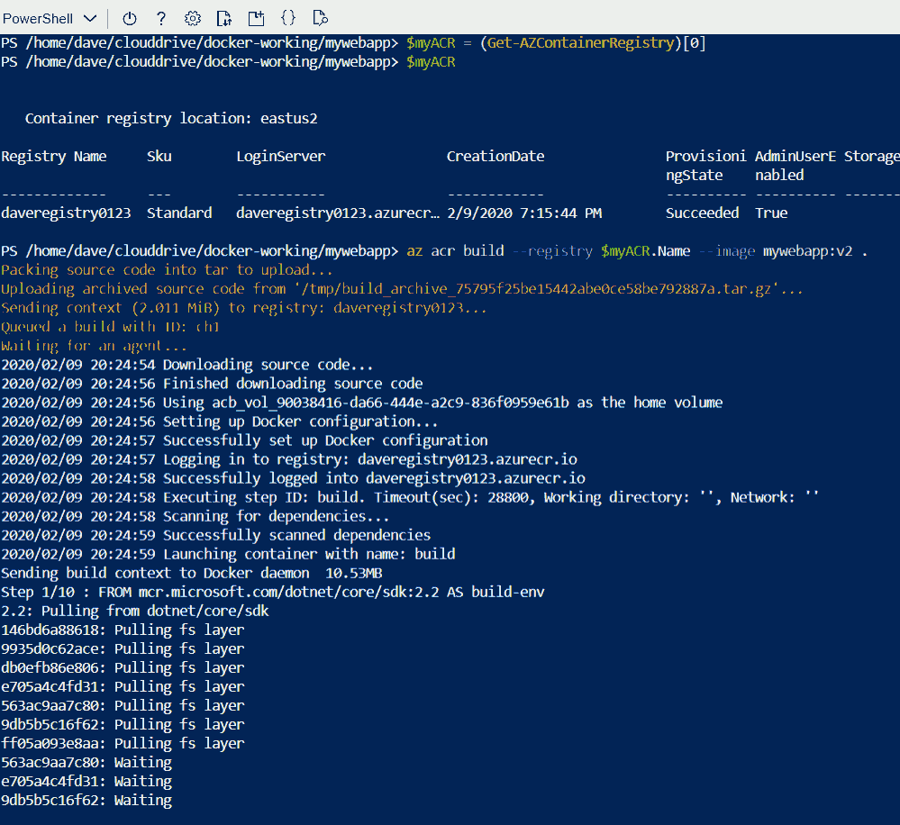

# How to use Build and Deploy Serverless ASP.Net Core Docker Application to Azure Container Instances Entirely Within Azure Cloud Shell

- [How to use Build and Deploy Serverless ASP.Net Core Docker Application to Azure Container Instances Entirely Within Azure Cloud Shell](#how-to-use-build-and-deploy-serverless-aspnet-core-docker-application-to-azure-container-instances-entirely-within-azure-cloud-shell)
  - [Introduction](#introduction)
  - [What You Will Learn](#what-you-will-learn)
  - [Prerequisites](#prerequisites)
  - [Step 1 - Get Into Azure Cloud Shell & Editor](#step-1---get-into-azure-cloud-shell--editor)
  - [Step 2 - Deploy Azure Container Registry with an ARM Template](#step-2---deploy-azure-container-registry-with-an-arm-template)
  - [Step 3 - Create a .Net Core Web Application](#step-3---create-a-net-core-web-application)
  - [Step 4 - Create a Docker File](#step-4---create-a-docker-file)
  - [Step 5 - Build and Push a Docker Image to Azure Container Registry](#step-5---build-and-push-a-docker-image-to-azure-container-registry)
  - [Step 6 - Prepare to Deploy Your Docker Image as a Serverless Container](#step-6---prepare-to-deploy-your-docker-image-as-a-serverless-container)
  - [Step 7 - Deploy Your Container, Review and Test](#step-7---deploy-your-container-review-and-test)
  - [Step 8 - Clean Up](#step-8---clean-up)
  - [Conclusion](#conclusion)

## Introduction

Keeping up with cloud technology is a continual challenge that requires continuous learning by cloud builders. As we seek to stay current with the evolution of new cloud technologies, we must decide which tools to invest our time in, choosing the most powerful and flexible tools available to maximize our effectiveness and time investment.

**Azure Cloud Shell** is one such powerful tool. Learn Azure Cloud Shell and you unlock the full capability of the Azure cloud, with tools built in including Code Editor, Azure PowerShell and CLI, .Net Core and Docker.

This tutorial introduces you to these tools very rapidly, and toward a very useful goal. You will create, build and publish a .Net Core application, inside a Docker container, to Azure in a Serverless deployment model.

## What You Will Learn

- Use the **[Azure Cloud Shell Editor](https://docs.microsoft.com/en-us/azure/cloud-shell/using-cloud-shell-editor)** to create a PowerShell script that sets variables for the tutorial.
- Deploy infrastructure as code using a Quickstart **[ARM Template](https://azure.microsoft.com/en-us/resources/templates/)**.
- Create an **ASP.Net Core** application with the [**.Net Core CLI](https://docs.microsoft.com/en-us/dotnet/core/tools/?tabs=netcore2x)** with no development environment setup.
- Use the **[Azure Cloud Shell Editor](https://docs.microsoft.com/en-us/azure/cloud-shell/using-cloud-shell-editor)** to create a docker file.
- Use **[Azure CLI](https://github.com/Azure/azure-cli)** *az acr build* command to build and push a docker image to your **[Azure Container Registry (ACR)](https://azure.microsoft.com/en-us/services/container-registry/)** with no tooling setup.
- Deploy a Docker image as a serverless container to **[Azure Container Instances](https://docs.microsoft.com/en-us/azure/container-instances/container-instances-overview)** with no infrastructure setup.
- Use **[Azure Cloud Shell](https://docs.microsoft.com/en-us/azure/cloud-shell/overview)** with **[Azure PowerShell](https://docs.microsoft.com/en-us/powershell/azure/get-started-azureps?view=azps-3.4.0)** and **[Azure CLI](https://github.com/Azure/azure-cli)** command line interface as powerful tools in infrastructure and application development and deployment.

## Prerequisites

In order to follow this guide, you will need:

- An active Azure subscription

## Step 1 - Get Into Azure Cloud Shell & Editor

Log into your Azure account at [portal.azure.com](https://portal.azure.com), then click the **Cloud Shell** icon in the top nav bar to enter the **Azure Cloud Shell**. If this is your first time in the shell you will need to create your cloud drive storage. First time users may refer to [David Lamb's Azure Cloud Shell tutorial (1.5 min)](https://www.youtube.com/watch?v=HBKm1-_kWKg) for guidance. Choose **PowerShell** as your shell type on the dropdown to the top left.

During the tutorial you may want to maximize the cloud shell window using the maximize button at the upper right. Click that button again to restore the cloud shell window back down to the original size.


Before continuing, note the prompt for Azure Cloud Shell, `PS Azure:\>` , indicates your location as `Azure:\`. You can imagine this as the root directory of a file server, but instead of files, it holds hierarchy of *all your Azure resources*. You can type `Get-ChildItem` to see your subscription(s), and use `Set-Location <TAB>` to begin navigating that hierarchy. *But that is the subject of another tutorial.*

If you try to use the code editor to save files in this starting location of `Azure:\`, you will get an error. Instead, type `cd ~\clouddrive` (that starts with the tilde character (~) at the top right of your keyboard, a symbol for your home directory) to navigate to your clouddrive, and type `pwd` (an alias of `Get-ChildItem`) to see your current location in the drive.

```ps
cd ~\clouddrive
pwd
```


Now type `code mySettings.ps1` to launch the cloud shell editor in your `~\clouddrive` folder and edit the new PowerShell script.

```ps
code mySettings.ps1
```

Use the editor to paste in the content of the powershell script below **using *Control-V* instead of right-click**. Customize the values, then click the ellipsis **(...)** in the upper right corner of the cloud shell editor to save, then close editor.

> ### **NOTE:** Globally Unique Names
> Naming things in Azure can be tricky, with different naming rules for different types of resources.
> For simplicity, *stick with lowercase letters and numbers.*
> Certain values must be GLOBALLY UNIQUE, like registry names and domain names,
> so something like 'DaveApp' doesn't usually work. It is a good idea to
> append numbers to a name, like _daveawesomedockerapp0123_ to create a unique name easily.

```ps
# Your personal settings, customize these using lowercase letters and numbers
$myLocationName = 'eastus2'                 # An Azure region close to you, 'Get-AzLocation' to list them all
$myRGName       = 'containerdemo-rg'        # Resource group to contain this demo
$myWebAppName   = 'davewebappdocker0123'    # Name for your web app
$myRegistryName = 'daveregistry0123'        # GLOBALLY UNIQUE name for your container registry
$myDNSName      = 'daveawesomedockerapp0123'# GLOBALLY UNIQUE dns name, will be prepended to .azurecontainer.io
```

Now **[dot source](https://ss64.com/ps/source.html)** the script by running `. ./mySettings.ps1`. This will define the variables you'll need for this tutorial in this PowerShell session.


> ### **WARNING:** If Cloud Shell session is interrupted, restart the session and re-run this script line
> The success of the tutorial depends on the variables above. If for some reason your
> **Azure Cloud Shell** [session is interrupted](https://docs.microsoft.com/en-us/azure/cloud-shell/limitations#system-state-and-persistence), (perhaps with an **access token expiry error**, or **unauthorized error**),
> You **may** need to restart your session with the **Restart Cloud Shell** button at top of shell window.
> Once you resume your session, remember to run `cd ~\clouddrive` since you can't save files in the `Azure:\` location, then run `. ./mySettings.ps1` again.
> This will ensure you can continue the tutorial.
> 
> 

## Step 2 - Deploy Azure Container Registry with an ARM Template

Next, you use `New-AzResourceGroup` to create a resource group for this demo.

```ps
New-AzResourceGroup -Name $myRGName -Location $myLocationName
```

Now you deploy your **Azure Container Registry** (ACR), once you have tested the name to ensure uniqueness.

```ps
Test-AzContainerRegistryNameAvailability -Name $myRegistryName
```

> ### **WARNING:** Ensure unique name for your Azure Container Registry
> If `NameAvailable` is not `True` in the result, redefine your registry name by running the command
> `$myRegistryName = 'mynewregname001'` and pressing **enter**. Then press **UP-Arrow** twice, scrolling through > command history to display the `Test-AzContainerRegistryNameAvailability` command, then press **enter** to
> run it again.

With your registry name verified as unique, you deploy a Quickstart **[Azure Resource Manager Template (ARM Template)](https://docs.microsoft.com/en-us/azure/azure-resource-manager/templates/overview)** from Microsoft's GitHub repository to create your **Azure Container Registry**. This ARM Template is a small JSON file that describes the resource to deploy, and you can [view the JSON for the ARM Template you will use here](https://raw.githubusercontent.com/microsoft/devops-project-samples/master/dotnet/aspnetcore/kubernetes/ArmTemplates/containerRegistry-template.json).  

Review and run the code below, which will set`$containerRegistryTemplateUrl` to the URL for this ARM Template that will define your **Azure Container Registry** resource. Then you define `$containerRegistryParams` as a [hash table](https://docs.microsoft.com/en-us/powershell/module/microsoft.powershell.core/about/about_hash_tables?view=powershell-7) to pass the parameters the template needs. Then you execute `New-AZResourceGroupDeployment` to deploy the ARM template.

Paste the code block below into the **Azure Cloud Shell** to deploy.

```ps
    $containerRegistryTemplateUrl = 'https://raw.githubusercontent.com/microsoft/devops-project-samples/master/dotnet/aspnetcore/kubernetes/ArmTemplates/containerRegistry-template.json'
    $containerRegistryParams = @{
        registryName        = $myRegistryName
        registryLocation    = $myLocationName
    }
    New-AZResourceGroupDeployment -Name "$myRGName-ACR-Deployment" -ResourceGroupName $myRGName -TemplateUri $containerRegistryTemplateUrl -TemplateParameterObject $containerRegistryParams

```

If all is well, the `ProvisioningState` value should display `Succeeded`


> ### **NOTE:** Troubleshoot using Activity Log
> If at first you don't succeed, review the **Activity Log**
> under **Notifications** in the portal.
> 

Next you use the `Get-AZContainerRegistry` command to store your **Azure Container Registry** (ACR) information in a variable to refer to it later in the tutorial.

```ps
$myACR = Get-AzContainerRegistry -ResourceGroupName $myRGName
$myACR
```


## Step 3 - Create a .Net Core Web Application

Begin from your clouddrive folder. Type `pwd` to verify your current location.

```ps
cd ~\clouddrive
pwd
```

Create a new folder `docker-working` and `cd` into it.

```ps
mkdir docker-working
cd docker-working
```


Now you will build a new .Net Core web application using the `dotnet` command line tool.

> ### **NOTE:** Alternately build an existing Asp.Net Core project
> Alternately, instead of creating a new application, you could use `git clone`
> to work with an existing application in GitHub. *This is another topic for a future tutorial.*

Paste the next 3 lines to create your new web app and its dependencies, then use `cd` to the new directory. You can run `ls` to inspect the contents of the published folder, or `gci -r`, and alias to `Get-ChildItem -Recurse` and see the entire contents of the application folder hierarchy.

```ps
dotnet new webapp -o mywebapp
cd mywebapp

pwd
```


## Step 4 - Create a Docker File

You can type `cls` any time to clear the screen, then type `code DOCKERFILE` from within your new webapp folder to launch the cloud shell editor and create a new file named DOCKERFILE.

```ps
code DOCKERFILE
```

Paste the following code block into the DOCKERFILE **using *Shift-Insert* or *Command-V* (macOS) instead of right-click**, then click the ellipsis **(...)** in the upper right corner of the cloud shell editor to save, then close editor.

```ps
FROM mcr.microsoft.com/dotnet/core/sdk:2.2 AS build-env
WORKDIR /app
# copy csproj and restore as distinct layers
COPY *.csproj ./
RUN dotnet restore
# copy everything else and build
COPY . ./
RUN dotnet publish -c Release -o out
# build runtime image
FROM mcr.microsoft.com/dotnet/core/aspnet:2.2-stretch-slim
WORKDIR /app
COPY --from=build-env /app/out .
ENTRYPOINT ["dotnet", "mywebapp.dll"]
```


> ### **NOTE:** Docker Syntax
> The dockerfile commands describe how to build and run the .Net Core web application created in Step 3 as a container.
> *Docker syntax is another topic for a future tutorial.*

## Step 5 - Build and Push a Docker Image to Azure Container Registry

First, run `pwd` to ensure you're in the root of the webapp folder, then use the [Azure CLI command `az acr build`](https://docs.microsoft.com/en-us/cli/azure/acr?view=azure-cli-latest#az-acr-build) shown below (including the period at the end) to build the docker image. This is a powerful tool that enables you to build docker images and push to a repository in one step, all without setting up or running docker on your workstation.

> ### **NOTE:**  Azure CLI in PowerShell
> You can use Azure CLI commands in Bash or PowerShell sessions.
> Sometimes Azure CLI is more terse than PowerShell, or new features may get support in Azure CLI before PowerShell, so use what gets the job done.

```ps
az acr build --registry $myACR.Name --image mywebapp:v1 .
```



> ### **WARNING:** Troubleshooting
> If you get an error on this step, possibly your Azure Cloud Shell [session is interrupted](https://docs.microsoft.com/en-us/azure/cloud-shell/limitations#system-state-and-persistence),
> you can repeat the code from above to define variables including those from the `. ./mySettings.ps1` command and ```$myACR``` then try it again:

```ps
# If Cloud Shell Session was interrupted, run to redefine your variables
cd ~/clouddrive
. ./mySettings.ps1
$myACR = Get-AzContainerRegistry -ResourceGroupName $myRGName
```

## Step 6 - Prepare to Deploy Your Docker Image as a Serverless Container

Gather information needed for deploying to **Azure Container Instances** using the `New-AzContainerGroup` command.

First, get your container repository from your container registry (ACR):

```ps
[array]$myRepositories = az acr repository list --name $myACR.Name | ConvertFrom-Json
$myRepository = $myRepositories[0]
$myRepository
```

Next, get the latest tag from the image in your container repository:

```ps
$myImageTags = az acr repository show-tags --name $myACR.Name --repository $myRepository --detail --orderby time_desc | ConvertFrom-JSON
$myImageTag = $myImageTags[0]
$myImageTag.name
```

Now build the path to the docker image you will deploy. Note the format is a DNS name that points to your **Azure Container Registry**, followed by the repository (**mywebapp**) and the tag (**v1**.)

```ps
$myDockerImagePath = "$($myACR.LoginServer)/$($myRepository):$($myImageTag.name)"
$myDockerImagePath
```

Since this is a private container registry, you need to provide credentials. Use the `Get-AzContainerRegistryCredential` command along with the `PSCredential` type accelerator to create the credential object.

```ps
$regCred = Get-AzContainerRegistryCredential -ResourceGroupName $myRGName  -Name $myACR.Name
$PSCred = [PSCredential]::New($regCred.Username, (ConvertTo-SecureString $regCred.Password -AsPlainText -Force)) # Type accelerators rule!
```

In this _optional_ step, you create a hash table to define resource tags, these are useful for keeping track of your Azure resources.

```ps
$tags = @{
    Env = 'Dev'
    Purpose = "Use Azure PowerShell command 'New-AzContainerGroup' to deploy containers from your Azure container registry easily!"
}
```

Now set up parameters in a hash table to pass to the command via [Splatting](https://devblogs.microsoft.com/scripting/use-splatting-to-simplify-your-powershell-scripts/)

```ps
$ContainerGroupArguments = @{
    ResourceGroupName   = $myRGName
    Name                = "$myWebAppName-cg"    #build container group name from the webapp name
    Image               = $myDockerImagePath
    IpAddressType       = 'Public'
    DNSNameLabel        = $myDNSName
    Port                = 80                    #optional
    RegistryCredential  = $PSCred               #required if this is NOT a public docker registry
    IdentityType        = 'SystemAssigned'      #optional, but useful for a future tutorial
    Tag                 = $tags                 #optional uses hash table defined above
    Debug               = $true                 #optional but very interesting to see the debug output
    }

# review contents of the parameter hash table

$ContainerGroupArguments
```

## Step 7 - Deploy Your Container, Review and Test

You are ready to deploy your new Azure container group by running the `New-AzContainerGroup` command. Since it has a `Debug` flag in the arguments, you will need to confirm the execution. Review the debug output in yellow for an interesting peek under the hood of Azure.

```ps
$newACG = New-AzContainerGroup @ContainerGroupArguments
```

After you confirm the execution and it completes, review the Debug output, then inspect your container group via the `$newACG` variable.

```ps
$newACG | Get-Member
$newACG | Select-Object *
```


The `FQDN` property is the *Fully Qualified Domain Name* of your containerized application. Paste this into your favorite browser to see your new ASP.Net Core serverless containerized web application in action.

```ps
Write-Output " Paste    $($newACG.FQDN)  into your favorite web browser"
```

*Browse your newly deployed Azure serverless Docker containerized ASP.Net Core web application!*


After browsing the web application, review the log of your container instance.

```ps
Get-AzContainerInstanceLog  -ResourceGroupName $myRGName -ContainerGroupName $ContainerGroupArguments.Name
```

## Step 8 - Clean Up

The resources for this tutorial are very cost effective. Even so, it's a good idea to clean up once completed.

```ps
Remove-AzResourceGroup -ResourceGroupName $myRGName -Force
cd ~/clouddrive
rm ./docker-working/ -r
```

## Conclusion

You have used **Azure Cloud Shell** on a whirlwind tour of powerful tools and features it contains.
You have:

- Created an **ASP.Net Core** web application
- Built a **Docker** container
- Pushed that container to a repository image in your private **Azure Container Registry**
- Deployed that image to **Azure Container Instances**

Along the way you explored features of **Azure Cloud Shell** including **Azure PowerShell** and **Azure CLI**, **Azure Resource Manager** templates, the **Cloud Shell Code Editor**, and the **.Net Core CLI.**

I hope this tutorial encourages you to explore Azure with the Cloud Shell, and makes you a more effective cloud builder!
